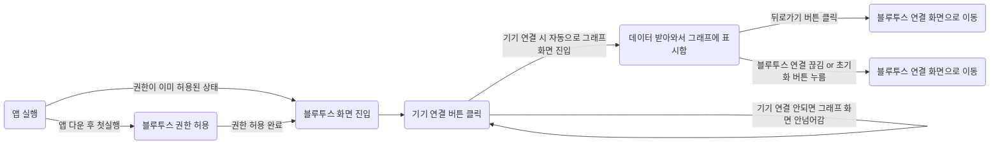

# HumanIn Project

## Refactor 내용

1. [Javascript로 작성된 HumanIn Project React Native 앱](https://github.com/i-soft-lab/humamin-react-native.git)을
   타입스크립트로 마이그레이션 했습니다.
2. `Webview`와 `ChartJs`로 구성된 차트를 `react-native-charts-wrapper`로 변경했습니다.
3. Sender에서 받아오는 데이터를 0.5초당 한개로 다운샘플링 했습니다.
4. wifi 스크린을 삭제했습니다.
5. 바텀바를 삭제하고, 블루투스가 연결되면 자동으로 그래프 화면으로 넘어가도록 하는 등 화면 플로우를 개선했습니다.

## 화면 플로우

